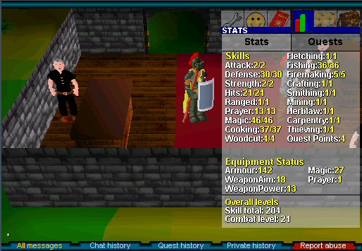
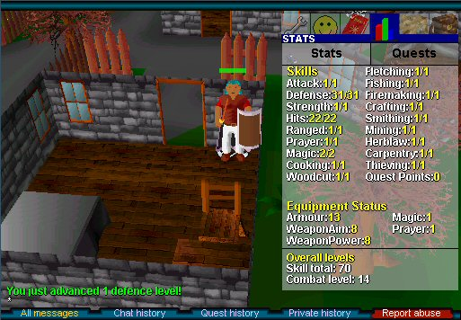
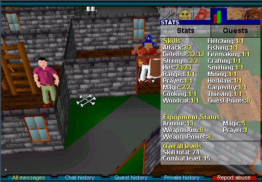
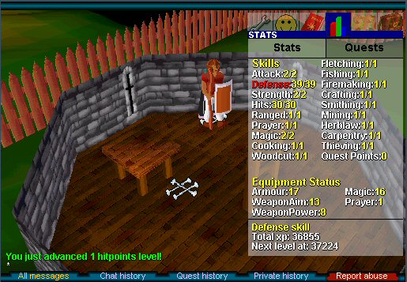
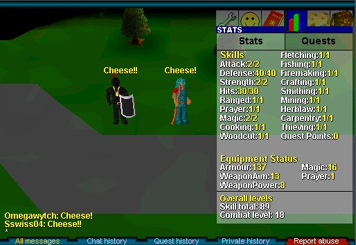

Blame it on Do0r Blocker. I saw him in Edgeville bank, and was astonished: Full adam at combat level 13?s

Blame it on my friend Sswiss04. When I mentioned Do0r Blocker to him, Sswiss told me he knows a player who wore rune at combat level 18.
 
Blame it on my friend Loraxx. When I mentioned the possibility of wearing rune at level 18, Loraxx replied, "That's just sick!"

How could I resist?

I already had a mage, Meretrix, with 16 defense and a combat level of 15. I had her spend a couple days killing Varrock sewer rats, bringing her def up to 30 and combat to 21.

Meretrix hated every minute of it, but when I dressed her up in adam plate, legs, and large, she immediately expressed her joy by sending a lvl 21 archer to Lumbridge in a one-on-one range war.

This was the first time any of my characters has ever been on the winning side of a wilderness fight. I was, um, OK with that... 

But wearing adam at 21 combat is just not the same as wearing rune at 18. I had to go for it.

The first step was choosing a good name. I wanted Omegabytch, to go with Alphabytch, my second RS character, who also wears rune. That name was "taken," but Omegawytch was available-- an appropriate name for the ultimate low-level PKing mage. 

After making my first visit to tutorial island, I headed for Lumbridge Castle's south tower. I figured that, competition permitting, I might as well gather some mind runes while killing the rats. My luck was remarkably good, and I grabbed about 300 runes and quite a few defense levels before competition dictated that I move on.

Where to go? Definitely not Varrock sewer-- too much competition. Definitely not chickens-- too many archers and other mages. Definitely not goblins-- with 1 att and 1 str, they just take too long. How about the rats in Draynor Village?

Bingo! Lots of rat spawns, and what little competition I encountered never lasted for long. Early in the second day of training, Omegawytch had surpassed Meretrix in defense level.

Until you try it yourself, you can't imagine how s l o w training is with 1 att and 1 str. Rats retreat after three rounds when they're down to 1 hp; there is no such thing as AFK training. Goblins and Men don't retreat, and I started fighting them occasionally, just to give my eyes and mouse hand a break. At one point, I hit 15 consecutive zeros on a Man.

A highwayman killed a newbie, then attacked me. I avenged the newbie's death, but I swear my main can kill two Entrana greaters with a Dramen staff in the time it took Omegawytch to kill that highwayman. I wore the fallen newbie's blue wizard hat in his honor.

For a moment, I feared a Man had been my undoing. It took so long to kill that the game logged me out. Shortly after I logged back in, I saw:

You just advanced one attack level!
You just advanced one strength level!

Nooooooooooo! I had forgotten to select "Defensive" combat style after I logged back in! Was all lost? A quick visit to [Cav's Combat Calculator](https://web.archive.org/web/20040906013326/http://www.cav.50megs.com/pklvl.html) assured me that I could still wear rune at 18 combat-- barely.

With 2 att and 2 str, training was faster-- like watching grass grow instead of lichens, perhaps. I started fighting more Men and Goblins, and, when I had saved up enough coins, trotted off to Varrock to buy a Magic staff, hoping that the improved weapon aim would speed things up a bit more.

On the third day, bored to tears with Draynor Village, I went back to Lumbridge Castle's south tower. Luck again was with me, and I grabbed a couple hundred more mind runes as the long ordeal neared its end.

With my goal achieved, I logged into my main to arrange suitable attire for Omegawytch-- and who should I encounter but Sswiss04, who had started me down this supremely silly path. 

(Too bad there wasn't someone else on the other side of Sswiss04, saying "Cheese!" We would have made a Sswiss cheese sandw... Nevvermind!)

After three loooooooong days of bashing rats, Omegawytch spent the fourth day maging chickens and fishing. She's now 34 magic, 40 fishing, and 40 cooking-- and pondering whether it's possible to kill the dragon with magic.

56warrior